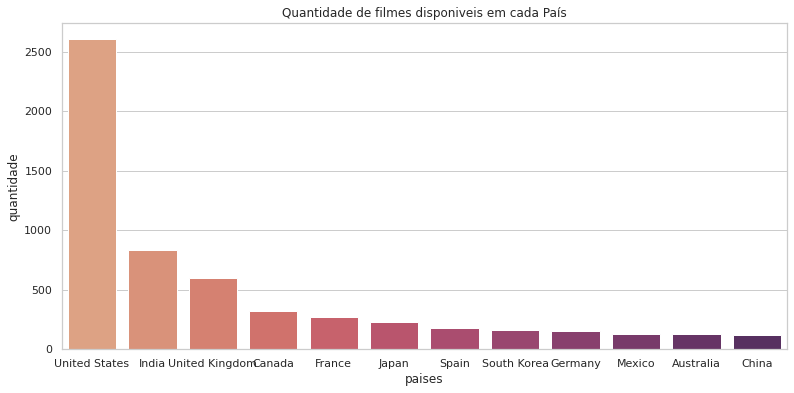
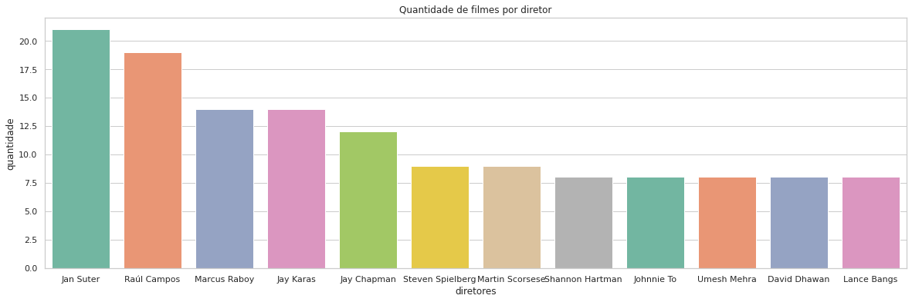
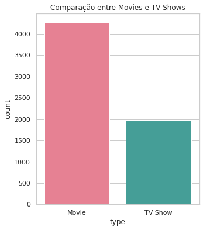
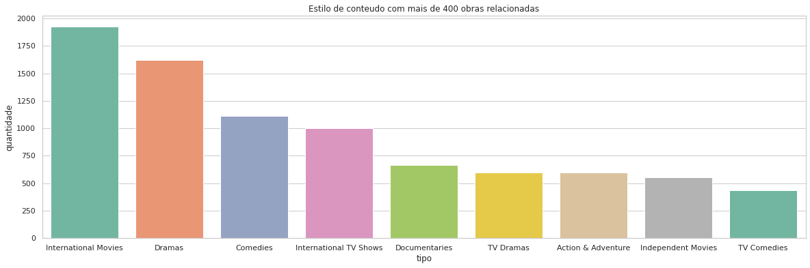
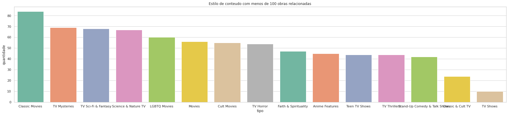
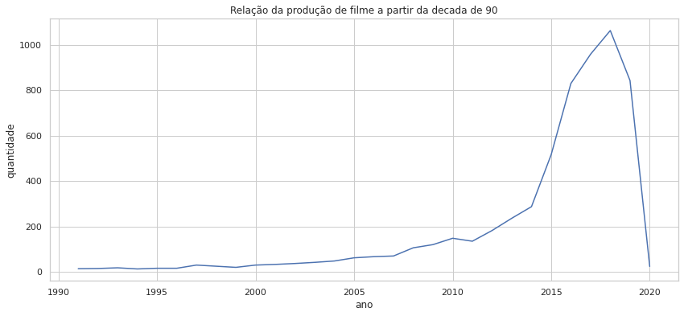

# Netflix_Movies_and_TV_Shows
Este trabalho faz uma análise do dataset "TV Shows and Movies listed on Netflix", afim de entender e visualizar os dados presentes nele. Algumas das questões analisadas foram:

- Paises com mais de 100 filmes disponiveis

- Diretores que produziram mais de 7 filmes

- Comparação entre o número de Movies e TV Shows produzidos

- Estilos de conteúdos produzidos

- Relação da produção de filmes a partir da década de 90. 

